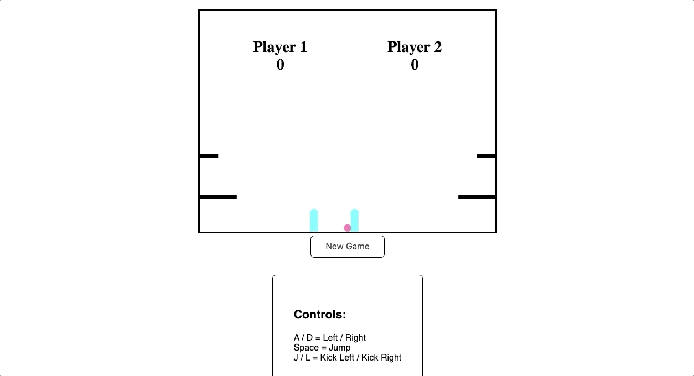

# Soccer

A real-time, multiplayer soccer game created using Express, Socket.IO, and Vanilla Javascript. It has built-in physics including velocity/acceleration, object collision, and gravity.

[Live Site](http://soccer-rjk.herokuapp.com/)

